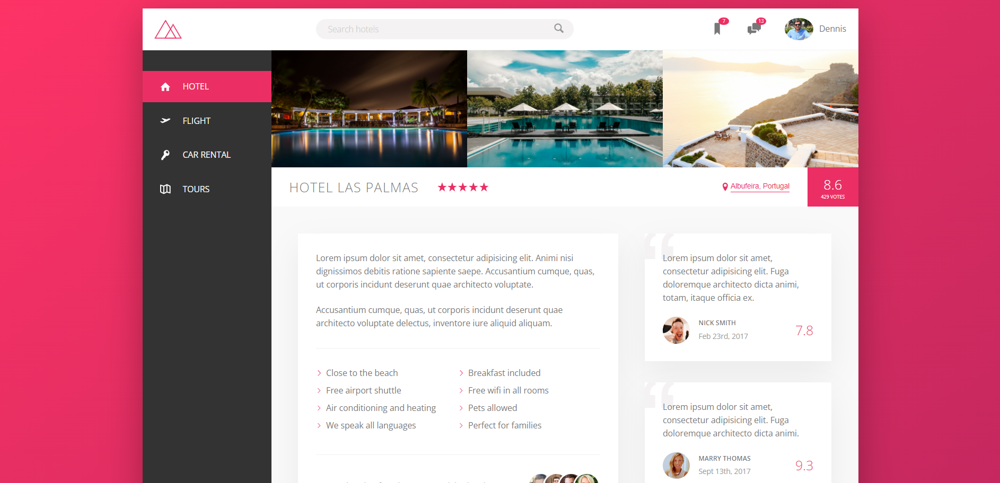

# 🏨 Trillo — Hotel Booking UI
> A fully responsive hotel booking interface built with advanced CSS techniques, inspired by a real-world application layout.

---

## 👀 Why This Project Stands Out

- Fully responsive down to **320px device width**
- Advanced CSS architecture and styling
- Complex layout using **Flexbox**
- Demonstrates understanding of **scalable CSS design**
- Production-style setup with `package.json` and minified CSS

---

## 🛠️ Tech Stack

- **HTML5** – Semantic and structured markup  
- **CSS3 (Advanced)** – Flexbox, variables, animations, media queries  
- **Google Fonts** – Open Sans  
- **SVG Icons** – SVG sprite technique  
- **NPM** – Project configuration & dependency management  

---

## ✨ Features

- Modern hotel booking dashboard UI  
- Responsive layout across desktop, tablet, and mobile  
- Sidebar navigation with active states  
- Ratings, reviews, and gallery sections  
- CSS variables for theme consistency  
- Minified CSS for optimized performance  

---

## 🧠 What I Learned

- Writing **scalable and maintainable CSS**
- Using **CSS custom properties (variables)**
- Building complex layouts with **Flexbox**
- Implementing **responsive design principles**
- Using **SVG sprites** for performance
- Understanding **CSS minification** and production builds
- Working with **NPM-based project setup**

> 📌 This project was built by coding along with **Jonas Schmedtmann’s Advanced CSS & Sass course**, helping me strengthen my understanding of professional CSS workflows and real-world UI design patterns.

---

## ⚙️ How to Run Locally

1. Clone the repository  
   ```bash
   git clone https://github.com/FrontEndHighRoller/Trillo-Booking-App.git
2. Open index.html in your browser
3. Resize the screen to see responsive layouts and image switching in action 🎯

---

🙋‍♂️ Author
Dennis Rumanek

GitHub: https://github.com/FrontEndHighRoller

LinkedIn: https://www.linkedin.com/in/dennis-rumanek/

⭐ If you like this solution, feel free to star the repository!
